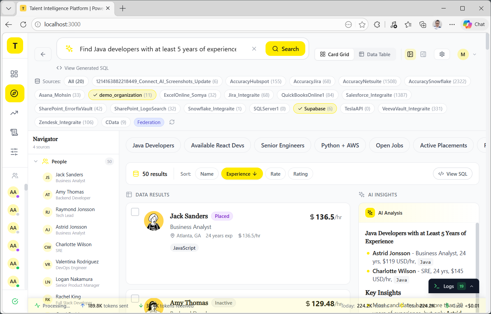
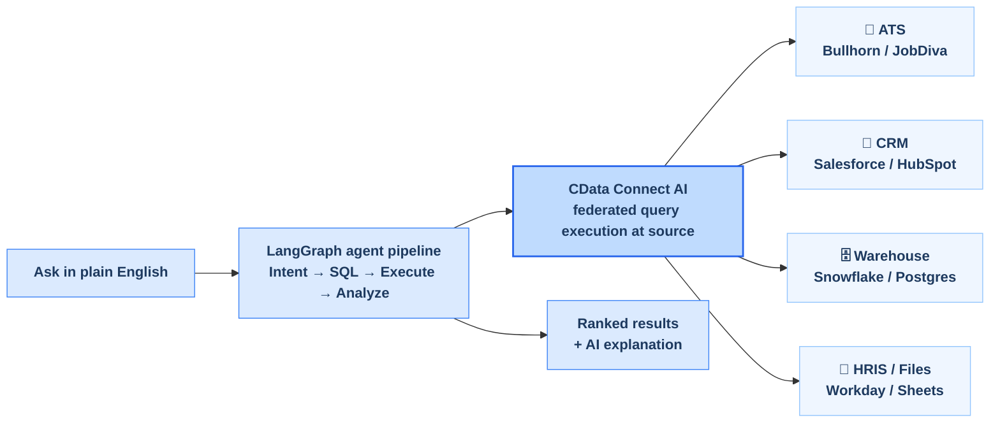
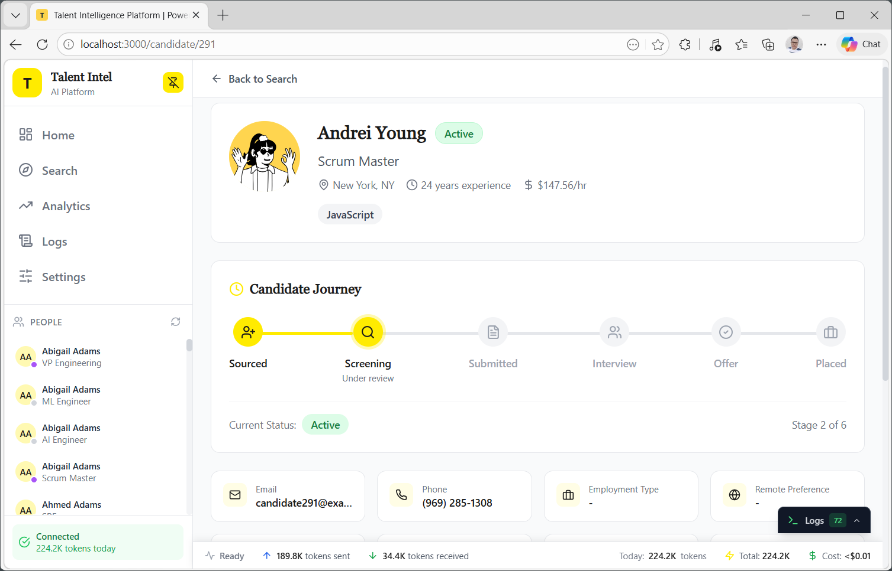
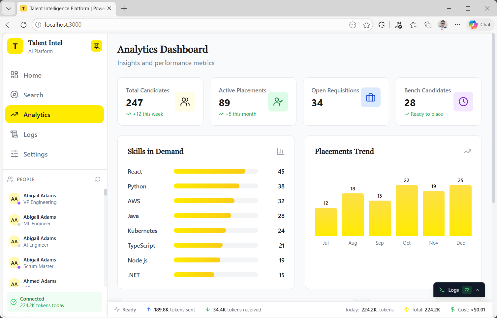

# Talent Intelligence Platform

Query all your recruiting data in plain English — across ATS, CRM, HRIS, and data warehouses — without replicating a single record. Federated queries execute live at each source, governed and auditable, through [CData Connect AI](https://www.cdata.com/connect/).

No data movement. No custom integrations. 350+ sources unified behind one natural language interface.

<p align="center">
  
</p>

---

## How It Works



Queries are pushed down to each connected source, so results always reflect live data without any replication or movement. A LangGraph orchestrator coordinates specialist agents — search, analysis, bulk operations, and write workflows each handled independently — before CData Connect AI federates the query across sources with schema translation and access control. The platform uses a REST-first architecture for all deterministic paths (sidebar, profiles, schema discovery), reserving MCP exclusively for the AI agent pipeline to keep rate limit budgets independent and latency low.

---

## Features

- **Cross-source federated queries** — break data silos without moving data; queries execute live at the source across ATS, CRM, HRIS, warehouses, and spreadsheets simultaneously
- **Natural language search** — ask "Find senior Java developers in Chicago available under $140K" and get ranked, AI-explained results
- **AI candidate matching** — relevance scores, skill gap highlights, and plain-English match reasoning from the LLM
- **Optimized architecture** — REST for all deterministic queries (30–50% faster than MCP on common paths); MCP reserved for NL agent queries only; independent rate limit budgets
- **Candidate profiles** — placement history, journey timeline, skills, and contact details
- **Analytics dashboard** — skills in demand, placement trends, recruiter performance metrics
- **350+ data sources via CData Connect AI** — Salesforce, Bullhorn, Workday, Snowflake, Supabase, Google Sheets, SharePoint, and more
- **Pluggable LLM** — supports Groq, Gemini, DeepSeek, Mistral, and OpenAI; Groq and Gemini offer free API tiers
- **Encrypted credentials** — AES-256-GCM client-side encryption; no backend database required
- **Query logs and cost tracking** — token usage, query history, and per-session cost monitoring

---

## Screenshots

| Candidate Profile | Analytics Dashboard |
|:---:|:---:|
|  |  |

---

## Quick Start

**Recommended — scripts handle install and browser launch automatically:**

- **Windows:** double-click `start.bat`
- **Mac / Linux:** run `./start.sh`

On first run, both scripts install dependencies and open the browser. No manual steps needed.

**Or manually:**

```bash
git clone https://github.com/mohsin-cdata/talent-intelligence-platform.git
cd talent-intelligence-platform
npm install
npm run dev
```

Open [http://localhost:3000](http://localhost:3000) and complete the 4-step setup wizard.

---

## Configuration

No `.env` file required. All credentials are configured through the in-app setup wizard on first launch:

1. **CData** — your CData Connect AI email, Personal Access Token, and endpoint
2. **Sources** — select which data source connections to query
3. **LLM** — choose a provider and enter your API key (Groq and Gemini are free)
4. **Review** — credentials are encrypted with AES-256-GCM and stored locally in your browser

To get a CData Connect AI account and Personal Access Token: [cloud.cdata.com](https://cloud.cdata.com)

---

## Tech Stack

| Layer | Technology |
|-------|-----------|
| Framework | Next.js 14.1 (App Router) |
| UI | React 18 + Tailwind CSS + Radix UI |
| State | Zustand with localStorage persistence |
| Agent pipeline | LangGraph |
| Data layer | CData Connect AI — REST + MCP |
| Auth | AES-256-GCM (Web Crypto API) |
| LLM | OpenAI-compatible SDK (multi-provider) |

---

## Data Sources

Connects to any of 350+ sources supported by CData Connect AI — including Bullhorn, Salesforce, Workday, Snowflake, PostgreSQL, Supabase, Google Sheets, SharePoint, and more. Schema is auto-discovered on first load; no hardcoded table or catalog names.

---

## Docs

- [Architecture](docs/ARCHITECTURE.md) — full system design: agent pipeline, REST-first data access, federated query flow, 5-layer rate limiter, auth, schema cache, and complete file structure
- [Business Use Case](docs/Business_Use_Case.md) — use cases, ROI model, and governance overview
---

## Using with Claude Code

This project includes a [`CLAUDE.md`](CLAUDE.md) that Claude Code reads automatically on startup. It covers the architecture constraints, key non-obvious behaviors, modification playbooks (swap data source, add LLM provider, add agent node), and a full recreation guide — so you can extend, debug, or adapt the platform without re-explaining the codebase.

---

## License

MIT — see [LICENSE](LICENSE)

---

## Author

Mohsin Turki ([mohammedmohsint@cdata.com](mailto:mohammedmohsint@cdata.com)), CData Software
