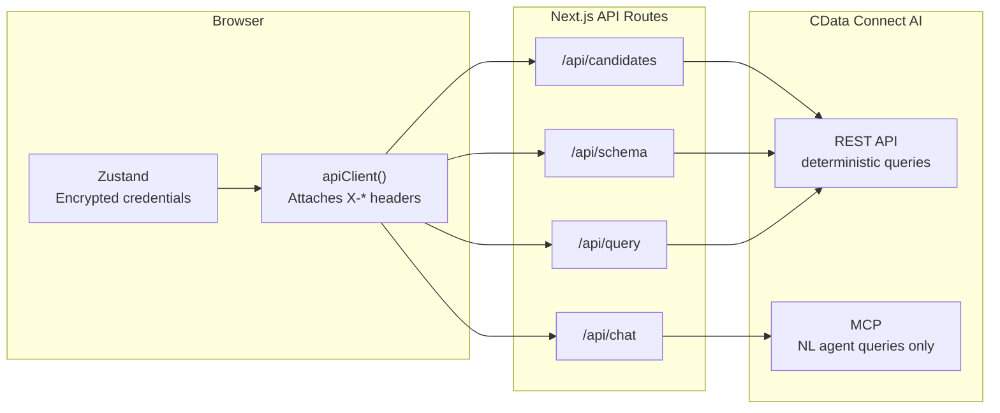
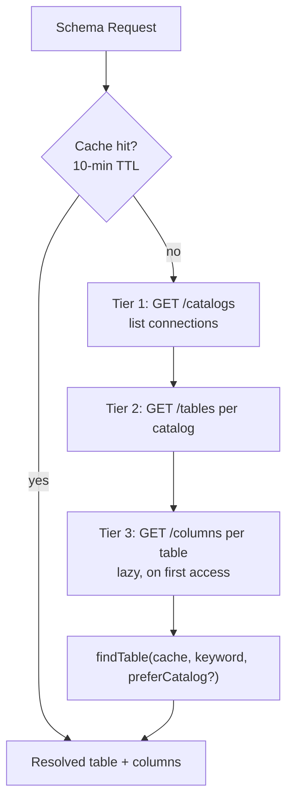
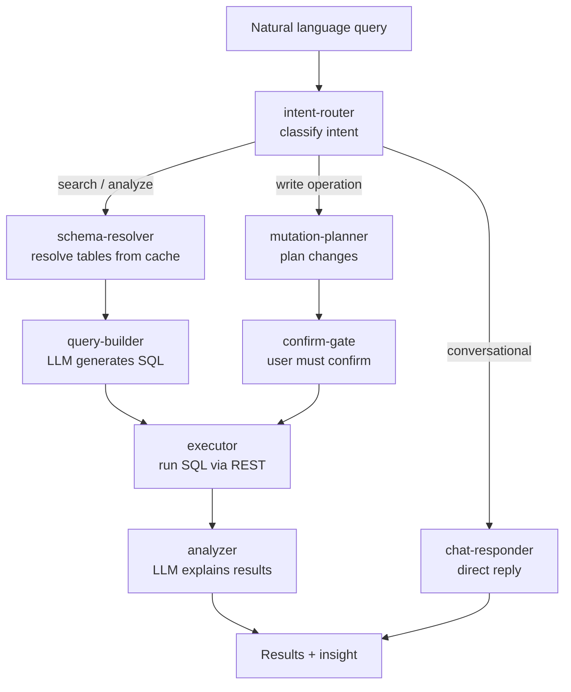
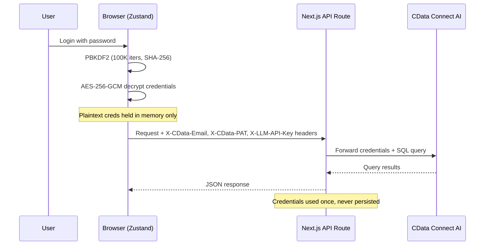

# Talent Intelligence Platform - Technical Architecture

## Overview

AI-powered recruiting intelligence platform enabling natural language queries over candidate, placement, and activity data from 350+ data sources via CData Connect AI.

**Version:** 2.0  
**Stack:** Next.js 14.1 (App Router), React 18, TypeScript, LangGraph, Zustand, CData Connect AI

---

## Tech Stack

| Layer | Technology | Purpose |
|-------|-----------|---------|
| Framework | Next.js 14.1 (App Router) | SSR, API routes, file-based routing |
| UI | React 18 + Tailwind CSS + Radix UI | Component architecture |
| Language | TypeScript | Type safety |
| State | Zustand (with localStorage persistence) | Global state, credential management |
| Agent pipeline | LangGraph | Multi-node agent orchestration |
| Data layer | CData Connect AI — REST + MCP | Universal data connector (350+ sources) |
| Auth | AES-256-GCM (Web Crypto API) | Per-user encrypted credential storage |
| LLM | OpenAI / Groq / DeepSeek / Gemini / Mistral | Pluggable multi-provider |
| Rate limiting | 5-layer custom system | Prevents quota exhaustion |

---

## Architecture Overview

The browser holds encrypted credentials in Zustand's localStorage store. On every request, `apiClient()` decrypts them in memory and attaches them as HTTP headers — they never touch the server filesystem. Next.js API routes receive the headers, execute a single query against CData Connect AI, and discard the credentials immediately.

```
Browser (React)
  └── Zustand auth store (AES-256-GCM encrypted credentials in localStorage)
  └── apiClient() — attaches decrypted credentials as HTTP headers per request
        └── Next.js API routes (server-side Node.js — credentials never persisted)
              ├── /api/chat          — NL query → LangGraph agent pipeline → results
              ├── /api/candidates    — sidebar list (REST, schema-cached)
              ├── /api/candidates/[id] — profile page (REST, 3 parallel queries)
              ├── /api/schema        — schema discovery (REST-first, MCP fallback)
              ├── /api/catalogs      — list available data source connections
              ├── /api/query         — direct SQL execution
              └── /api/test-connection — wizard credential validation
                    └── CData Connect AI
                          ├── REST API (cloud.cdata.com/api) — deterministic queries
                          └── MCP (mcp.cloud.cdata.com/mcp) — NL agent queries only
```



**Key design decision:** REST handles all deterministic data access (sidebar, profiles, schema discovery, direct SQL). MCP is reserved for LLM-generated natural language queries only. This keeps rate limit budgets independent and keeps common-path latency low.

---

## Data Access: REST-First Architecture

The platform enforces a strict REST-first policy for all schema and data access. CData's REST API is faster and more quota-efficient than MCP for predictable queries — sidebar loads, profile pages, and schema discovery all use REST. MCP is reserved exclusively for the AI agent pipeline, so the two rate limit budgets never interfere with each other.

All schema discovery and data retrieval uses the CData REST API (`cloud.cdata.com/api`):

- `GET /catalogs` — list available connections
- `GET /tables?catalog=X` — list tables in a connection
- `GET /columns?catalog=X&table=Y` — get column metadata
- `POST /query` — execute SQL, returns `{ results: [...], schema: [...] }`

Results from `/query` are returned as arrays. `zipRows()` in `cdata-rest-client.ts` zips each row array with the schema to produce objects. It checks `columnName`, `COLUMN_NAME`, and `name` field variants — all three appear in different CData response types.

**Schema cache (`src/lib/agents/schema-cache.ts`):** Tiered discovery with 10-minute TTL. Schema is fetched once and shared across all requests. Individual API routes call `getCachedSchema()` — they do not fetch schema independently.

- Tier 1: GET /catalogs — list connections
- Tier 2: GET /tables per catalog
- Tier 3: GET /columns per table (lazy, on first access)

`findTable(cache, keyword, preferCatalog?)` matches tables by keyword heuristics. The optional third parameter scopes the search to a preferred catalog first to avoid collisions when multiple sources have similarly-named tables.



---

## Agent Pipeline (LangGraph)

Natural language queries enter the orchestrator, which routes them through a LangGraph multi-node graph. The intent router classifies the query first. From there, the pipeline sequences through schema resolution (fetching relevant table and column metadata), SQL generation by the LLM, execution against the REST client, and LLM-driven analysis of the results. Write operations take a separate path through the mutation planner and confirm-gate nodes — user confirmation is required before any data changes execute.

```
/api/chat
  └── orchestrator.ts
        └── LangGraph graph (graph.ts)
              ├── intent-router node    — classifies query (search / analyze / action / chat)
              ├── schema-resolver node  — resolves relevant tables from cache
              ├── query-builder node    — LLM generates SQL from schema context
              ├── executor node         — runs SQL via REST client
              ├── analyzer node         — LLM generates insight from results
              ├── chat-responder node   — handles conversational replies
              ├── mutation-planner node — plans write operations
              └── confirm-gate node     — requires user confirmation for mutations
```



**Specialist agents** (called from orchestrator for specific intents):
- `search-agent.ts` — candidate search
- `analyst-agent.ts` — data analysis
- `action-agent.ts` — write operations
- `bulk-agent.ts` — multi-record operations
- `chain-agent.ts` — multi-step queries
- `gatherer-agent.ts` — data aggregation

**Model router (`model-router.ts`):** Routes each node to the appropriate LLM provider based on task type. SQL generation uses a cheaper/faster model; analysis uses a more capable one.

---

## Rate Limiter (5-Layer System)

The rate limiter guards against quota exhaustion from runaway queries, dev-mode double-renders, and accidental fetch loops. Each layer catches a different failure mode: the file ledger survives server restarts, the circuit breaker trips on repeated API failures, the sliding window throttles individual routes, and the dedup cache eliminates redundant identical queries. The gateway is integrated at the REST client layer — the deepest point — rather than at individual routes, to avoid double-counting.

All API routes and the REST client pass through `src/lib/rate-limiter.ts`:

1. **Persistent file ledger** (`data/query-ledger.jsonl`) — survives server restarts, 200 req/hr ceiling. Counts only `success` and `error` entries — `blocked` entries are excluded to prevent death spiral.
2. **Global in-memory ceiling** — 200 req/hr across all routes
3. **Circuit breaker** — trips after 5 consecutive failures, 60-second cooldown
4. **Route-level sliding window** — e.g., `/api/candidates`: 5 req/30s, `/api/candidates/[id]`: 20 req/30s
5. **Dedup cache** — identical SQL within 30s returns cached result without a new query

Gateway is integrated at the REST client layer (deepest), not at individual route level, to avoid double-counting and React StrictMode double-render issues.

---

## Authentication & Credential Flow

Credentials are encrypted in the browser before leaving the user's machine and are never written to the server filesystem or any database. The API routes receive them as request headers and hold them only for the duration of a single request. On logout, plaintext credentials are cleared from Zustand memory immediately.

```
First visit → LoginScreen → CreateProfileForm
                              └── password → PBKDF2 (100K iterations, SHA-256)
                                              └── AES-256-GCM encrypt credentials
                                                    └── store in localStorage

Login → decrypt credentials → hold in Zustand memory only
          └── apiClient() reads decrypted creds → attaches as X-* headers
                └── API routes receive via headers, use once, discard
```



**Setup wizard (4 steps):**
1. CData email + PAT + endpoint → test connection via `/api/test-connection`
2. Select data source catalogs from `/api/catalogs`
3. Choose LLM provider + API key + model
4. Review + save (encrypts everything with user password)

---

## Field Resolver (`src/lib/field-resolver.ts`)

CData sources use inconsistent column naming: `FirstName`, `first_name`, `FIRST_NAME`, `firstName` all appear depending on the connector. The field resolver maps canonical names to actual column names:

- `resolveField(candidate, 'firstName')` — checks all naming variants
- `resolveColumnName('lastName', columns)` — finds actual column name from schema
- `getDisplayName(candidate)` — returns formatted full name
- `getPrimaryId(candidate)` — returns the integer or string candidate ID

Canonical names cover: `candidateId`, `firstName`, `lastName`, `email`, `phone`, `title`, `status`, `skills`, `location`, `availableDate`, `desiredRate`, `employmentType`, `remotePreference`, `clearance`, `summary`, and others.

---

## File Structure

```
src/
  app/
    api/
      candidates/route.ts         — sidebar list, REST, schema-cached, ORDER BY resolved
      candidates/[id]/route.ts    — profile + placements + activities (parallel REST)
      catalogs/route.ts           — list CData connections
      chat/route.ts               — NL query → agent pipeline
      query/route.ts              — direct SQL execution
      schema/route.ts             — schema discovery (tiered)
      test-connection/route.ts    — wizard credential validation
      config/route.ts             — runtime config (public)
      cdata/route.ts              — generic CData proxy
    candidate/[id]/page.tsx       — candidate profile page (dynamic route)
    views/
      AnalyticsPage.tsx           — token usage, query stats, cost tracking
      LogsPage.tsx                — query history with SQL + duration
      SettingsPage.tsx            — LLM config, data sources, theme, profile
    page.tsx                      — main search interface
    layout.tsx                    — root layout, auth gate

  components/
    auth/
      LoginScreen.tsx             — profile selector + password
      CreateProfileForm.tsx       — new profile, PBKDF2 → AES-256-GCM
      ProfileMenu.tsx             — switch profile, logout
    wizard/
      ConnectionWizard.tsx        — 4-step setup modal
      steps/CDataStep.tsx         — CData email + PAT + endpoint
      steps/DataSourceStep.tsx    — catalog selection
      steps/LLMProviderStep.tsx   — provider + key + model
      steps/ReviewStep.tsx        — summary + save
    candidates/
      CandidateCard.tsx           — candidate result card
      CandidateJourney.tsx        — placement timeline
    entities/
      EntityCard.tsx / EntityList.tsx / EntityProfile.tsx / StatusBadge.tsx
    layout/
      Sidebar.tsx                 — hover/pin sidebar, candidate list, Zustand-synced width
    search/
      SearchBar.tsx               — NL input
      SearchResults.tsx           — split view: results (65%) + AI panel (35%)
      QuickQueries.tsx            — preset query chips
    sources/
      SourceSelector.tsx          — data source picker
    ui/
      TokenUsageBar.tsx / ExportBar.tsx / LiveTerminal.tsx / ModelSelector.tsx
      Avatar / EditableField / LoadingSkeleton / MarkdownRenderer / MutationToast
      PasswordInput / SkillBadge / StatusBadge / StatusIndicator / StepIndicator
      ThemeSync / ViewSwitcher

  lib/
    agents/
      index.ts                    — orchestrator entry point
      orchestrator.ts             — routes queries to agents or graph
      graph.ts                    — LangGraph graph definition
      intent-router.ts            — top-level intent classification
      model-router.ts             — per-task LLM provider selection
      schema-cache.ts             — tiered schema discovery + findTable()
      types.ts                    — shared agent types
      nodes/
        intent-router.ts          — LangGraph intent node
        schema-resolver.ts        — resolves tables from cache
        query-builder.ts          — LLM → SQL generation
        executor.ts               — SQL execution via REST
        analyzer.ts               — LLM insight generation
        chat-responder.ts         — conversational replies
        mutation-planner.ts       — write operation planning
        confirm-gate.ts           — mutation confirmation gate
      search-agent.ts / analyst-agent.ts / action-agent.ts
      bulk-agent.ts / chain-agent.ts / gatherer-agent.ts / tools.ts
    api-client.ts                 — frontend fetch wrapper, injects X-* headers
    auth-store.ts                 — Zustand: profiles, encryption, session
    auth-context.tsx              — React context: auth gate
    cdata-client.ts               — MCP client (NL agent queries only)
    cdata-rest-client.ts          — REST client (all deterministic queries)
    config.ts                     — environment config reader
    crypto.ts                     — AES-256-GCM + PBKDF2 (Web Crypto API)
    field-resolver.ts             — canonical field name → actual column name
    rate-limiter.ts               — 5-layer rate limiting
    store.ts                      — Zustand: search state, candidates, UI
    mutation-manager.ts           — write operation coordination
    compensation.ts               — rate/compensation field helpers
    geo-utils.ts                  — location parsing utilities
    query-templates.ts            — pre-built SQL templates
    schema-mapping.ts             — cross-source schema normalization
    scoring.ts                    — candidate relevance scoring
    useSchemaMap.ts               — React hook for schema access
    openai-client.ts              — multi-provider LLM (OpenAI-compatible SDK)
    utils.ts                      — cn() and general helpers

  types/index.ts                  — shared TypeScript types
```

---

## API Routes

| Route | Method | Purpose |
|-------|--------|---------|
| `/api/chat` | POST | NL query → agent pipeline → results + analysis |
| `/api/candidates` | GET | Sidebar candidate list (REST, ORDER BY resolved from schema) |
| `/api/candidates/[id]` | GET | Profile + placements + activities (3 parallel REST queries) |
| `/api/schema` | GET | Tiered schema discovery (REST-first, MCP fallback) |
| `/api/catalogs` | GET | List CData connections |
| `/api/query` | POST | Direct SQL execution |
| `/api/test-connection` | POST | Wizard credential validation |
| `/api/config` | GET | Runtime config (public, no auth) |
| `/api/cdata` | POST | Generic CData proxy |

**Credential headers on all authenticated routes:**
- `X-CData-Email` / `X-CData-PAT` / `X-CData-Endpoint`
- `X-LLM-Provider` / `X-LLM-API-Key` / `X-LLM-Model`
- `X-Locked-Tables` — catalog scope restriction

---

## LLM Providers

All providers use the OpenAI-compatible SDK with dynamic `baseURL`:

| Provider | Free | Base URL |
|----------|------|----------|
| Groq | Yes | `https://api.groq.com/openai/v1` |
| Gemini | Yes | `https://generativelanguage.googleapis.com/v1beta/openai/` |
| DeepSeek | No | `https://api.deepseek.com` |
| Mistral | No | `https://api.mistral.ai/v1` |
| OpenAI | No | `https://api.openai.com/v1` |

Model routing in `model-router.ts` assigns providers per task: cheaper/faster models for SQL generation, more capable models for analysis and chat.

---

## State Management

**Main store (`store.ts`) — persisted:**
- `settings`: theme, llmProvider, llmModel, cdataEndpoint
- `queryLogs`: query history (SQL, tokens, duration, cache hit)
- `lockedDataSources`: selected catalog scope
- `cachedCandidates`: sidebar candidate list (survives page refresh)

**Auth store (`auth-store.ts`) — split:**
- Persisted: `profiles` array with encrypted credentials, `activeProfileId`
- Memory only: decrypted credentials, plaintext password (cleared on logout)

**Sidebar state:** `sidebarExpanded` synced from hover+pin state. Main content and TokenUsageBar shift margin based on actual sidebar width.

---

## Constraints & Non-Obvious Behavior

**Credentials never leave the browser unencrypted.** API routes receive them via headers, never store them. Do not add server-side credential persistence.

**`zipRows()` checks three column name variants.** CData returns `columnName` (camelCase) in schema endpoints but `COLUMN_NAME` (uppercase) in some query results. Do not simplify to one format.

**`getLedgerCount()` excludes `blocked` entries.** Counting blocked requests toward the ceiling causes a death spiral. Only `success` and `error` count.

**Never add state variables to sidebar `useEffect` deps** that change as a result of the fetch completing. Use a `useRef(fetchAttempted)` guard instead.

**React StrictMode double-renders in dev.** Route-level gateway checks on frequently-called routes exhaust sliding windows immediately. Keep gateway at the REST client layer only.

**Numeric IDs must be unquoted for PostgreSQL.** Detect with `/^\d+$/.test(id)` and use unquoted integer in SQL. CData does not always coerce `'9169'` to an integer for `candidate_id` columns.

**`findTable()` takes an optional `preferCatalog` third param.** Pass it whenever you know which catalog should take priority — prevents wrong-source matches when multiple catalogs have similarly-named tables.

**Schema cache is shared across all requests.** Use `getCachedSchema()` in API routes. Do not duplicate schema fetching.

---

## Deployment

**Local:** `npm run dev` → `http://localhost:3000`  
Or double-click `start.bat` (Windows) / `./start.sh` (Mac/Linux)

**Vercel:** Connect repo, set env vars in Vercel dashboard (optional — users can configure via the in-app wizard instead).

**Docker:**
```dockerfile
FROM node:18-alpine
WORKDIR /app
COPY package*.json ./
RUN npm ci
COPY . .
RUN npm run build
EXPOSE 3000
CMD ["npm", "start"]
```

**Environment variables** (all optional if using per-user auth wizard):
```
CDATA_EMAIL / CDATA_PAT / CDATA_ENDPOINT
OPENAI_API_KEY / GROQ_API_KEY / DEEPSEEK_API_KEY
NEXT_PUBLIC_APP_NAME
```

**To clear rate limiter between dev sessions:** delete `data/query-ledger.jsonl` and restart.

---

## Key Design Decisions

| Decision | Rationale |
|----------|-----------|
| REST-first, MCP for NL only | Keeps rate limit budgets separate; REST is 30-50% faster for deterministic queries |
| LangGraph agent pipeline | Composable nodes; easy to add/remove steps without touching other agents |
| 5-layer rate limiter | Defense in depth — each layer catches different failure modes |
| Field resolver pattern | CData column naming varies by connector; canonical names decouple UI from schema |
| AES-256-GCM client-side auth | Multi-user without a backend database; credentials never touch the server |
| Schema cache with findTable() | One schema fetch per hour; keyword matching avoids hardcoded table names |
| `preferCatalog` on findTable() | Prevents wrong-source matches in multi-catalog workspaces |

---


Mohsin Turki ([mohammedmohsint@cdata.com](mailto:mohammedmohsint@cdata.com))  
CData Software