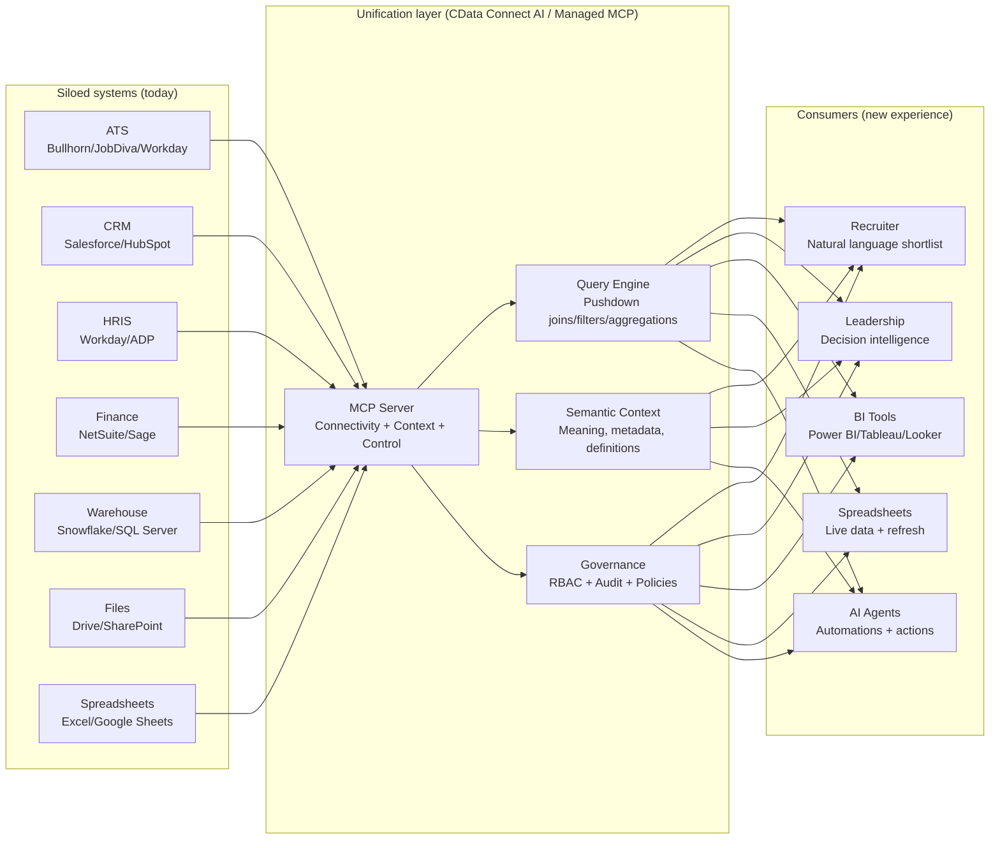
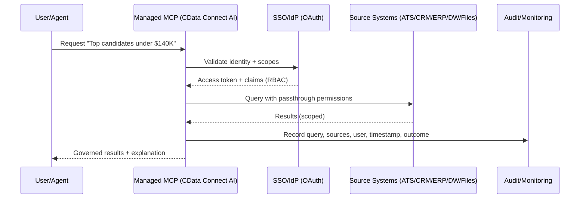
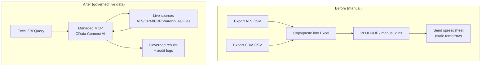
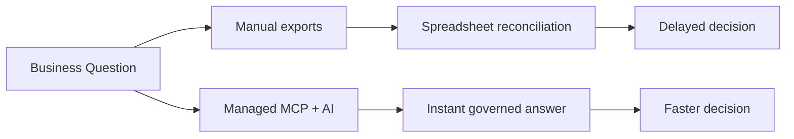
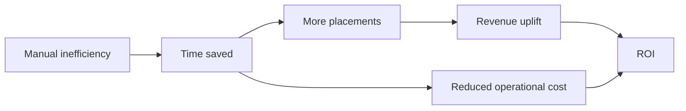

# Talent Intelligence Platform  
## Business Overview, Use Cases & Strategic Opportunity (Sales + Enterprise Controls)

---

## Executive Summary

The **Talent Intelligence Platform** is an enterprise-grade recruiting intelligence layer built on a **managed Model Context Protocol (MCP) platform** using **CData Connect AI**.

It transforms fragmented ATS, CRM, HRIS, ERP, data warehouse, spreadsheets, and file systems into a **unified, governed, real-time intelligence layer** that recruiters and executives can query using natural language.

Instead of searching manually through siloed systems or exporting spreadsheets, teams can ask:

- "Find 5 Java developers in Chicago available now under $140K."
- "Which clients generated the highest margin placements this quarter?"
- "Which recruiters are trending below placement targets?"
- "Where are we losing candidates in the pipeline, and why?"
- "What skills are rising in demand vs what we have on the bench?"

This platform converts enterprise recruiting data into **instant, actionable intelligence** with **security, governance, audit, and compliance controls**.

---

## The Big Problem: Siloed Systems Slow Down Decisions

Most organizations run recruiting operations across multiple systems:

- **ATS:** Bullhorn, JobDiva, Workday Recruiting
- **CRM:** Salesforce, HubSpot, Dynamics
- **HRIS:** Workday, ADP, BambooHR
- **Finance:** NetSuite, Sage Intacct, QuickBooks
- **Data:** Snowflake, SQL Server, spreadsheets
- **Files:** Google Drive, SharePoint

Data exists everywhere. It is rarely unified.

That creates predictable pain:

- **Slow reporting cycles** (days to answer basic questions)
- **Manual exports to Excel** and error-prone reconciliation
- **No 360 view** across candidates, clients, placements, and revenue
- **Delayed actions** (stalled deals, aging reqs, underutilized bench)
- **Shadow AI risk** (employees paste data into tools without governance)

---

## Why Build This?

### 1. Recruiting Is Data-Rich but Insight-Poor

Most staffing and recruiting firms already have:

- Bullhorn, JobDiva, Workday, or other ATS systems
- CRM systems
- Email history
- Placement and billing data
- Candidate resumes and skill databases

The problem is not lack of data.  
The problem is slow, fragmented access to it.

Recruiters spend 60-70% of their time searching systems instead of placing talent.

### 2. Manual Search Is Revenue Leakage

In staffing, time = placements = revenue.

Delays in:

- Candidate search
- Skill matching
- Client response time
- Identifying best-fit candidates

Directly reduce revenue.

If a recruiter closes even one additional placement per quarter due to faster matching, the platform pays for itself.

### 3. Native ATS Search Is Limited

Most ATS systems:

- Use keyword search (no semantic matching)
- Do not understand skill synonyms
- Do not score relevance contextually
- Cannot unify across systems
- Do not provide predictive insights

This platform introduces:

- Semantic skill matching
- Relevance scoring
- Cross-system intelligence
- AI-driven explanation of matches

---

## Powered by Managed MCP: Connectivity, Context & Control

The platform uses **CData Connect AI** as the managed MCP layer to deliver:

- **Connectivity:** every system, one interface (350+ sources)
- **Context:** semantic intelligence to reason like a human analyst with fewer tokens
- **Control:** identity-first security, least-privilege, auditability, governance

---

### Data Unification Layer (What Changes)

*Result: One governed data layer powers humans, BI, spreadsheets, and AI agents.*

---

### Connectivity (Business View)
CData Connect AI provides:

- Universal access to 350+ enterprise systems
- Pre-built connectors to SaaS, databases, APIs, and legacy systems
- Deep API coverage that reaches relevant objects and endpoints
- A dedicated query engine where joins, filters, and aggregations execute at the source
- Cross-system intelligence via schema translation and federation

**Business impact:** faster time-to-insight without custom integration projects.

### Context (Business View)
Context converts raw data into business understanding:

- Source-level semantic intelligence (meaning behind fields and objects)
- Lean token footprint (query pushdown and derived views reduce cost and noise)
- Curated multi-source data collections to direct AI to specific workflows
- Enhanced per-source MCP instructions for faster, more accurate queries
- Documents as data for retrieving and editing files without complex pipelines

**Business impact:** higher accuracy, fewer hallucinations, and more predictable costs.

### Control: Security, Governance, Audit & Compliance
Enterprise AI must operate inside security boundaries, not around them.

**Identity & Access Control**
- OAuth 2.1 support with PKCE and SSO integration
- Identity passthrough so source RBAC is honored automatically
- Least-privilege controls and down-scoped access
- User-level authentication so access is governed by existing permissions
- *Bottom line: AI can only access what the user is allowed to access.*

**Auditability & Observability**
- Query-level logging across every connected source
- Traceability: who asked, what was accessed, what happened
- Central monitoring and governance visibility for IT/security
- Policy enforcement logs for compliance monitoring
- *Bottom line: every interaction is inspectable and auditable.*

**Compliance Readiness**
- Minimize replication to reduce data sprawl
- Enforce policies at access time
- Support sensitive-data controls via scopes and least-privilege
- Align with enterprise risk controls: authentication, authorization, logging, change control

### Governance Control Plane

---

## Core Business Value

### 1. Increase Recruiter Productivity
**Before**
- 20-40 minutes to build a strong shortlist
- Manual filtering
- Guesswork on skill relevance

**After**
- 90-second AI-powered shortlist
- Ranked candidates with explanation
- Skill gaps highlighted

**Impact:** higher placement velocity per recruiter.

### 2. Reduce Recruiter Ramp-Up Time
New recruiters typically take 6-12 months to learn internal candidate pools.

**With AI:**
- "Show senior React developers previously placed at fintech companies."
- "Who is on the bench with DevOps + AWS experience?"

**Impact:** faster onboarding = faster revenue contribution.

### 3. Unlock Executive Visibility
Leadership gains access to:
- Placement trends
- Margin analysis
- Recruiter performance metrics
- Skill demand trends
- Bench utilization

*Without building a new data warehouse project.*

### 4. Enable Premium AI Service Offering
Staffing firms can use this platform to:
- Offer AI-powered candidate matching to clients
- Provide instant talent intelligence insights
- Differentiate from competitors still using manual search

This shifts the firm from a traditional recruiter to a technology-enabled talent intelligence provider.

---

## Target Use Cases

### 1. AI Candidate Matching
- **User:** Recruiter
- **Query:** "Find senior Java engineers in Chicago available immediately under $140K."
- **System response:**
  - Ranked candidates
  - Match score breakdown
  - Missing skill indicators
  - Compensation alignment check
  - Availability confirmation

### 2. Bench Optimization
- **User:** Recruiting Manager
- **Query:** "Who is available this week by skill and location?"
- **Impact:** Reduces bench idle time, improves revenue per recruiter, maximizes placement probability.

### 3. Client Fit Intelligence
- **User:** Account Manager
- **Query:** "Find candidates who previously worked at companies similar to JP Morgan."
- **Impact:** Faster pitch preparation, higher client confidence, increased win rate.

### 4. Skills Gap & Demand Analysis
- **User:** Executive Leadership
- **Query:** "What skills are most requested this quarter vs what we have?"
- **Impact:** Smarter sourcing strategy, proactive candidate acquisition, better market positioning.

### 5. Recruiter Performance Analytics
- **User:** Director of Recruiting
- **Query:** "Which recruiters have the highest placement rate this quarter?"
- **Impact:** Performance benchmarking, coaching insights, incentive alignment.

---

## Excel and BI: Meet Teams Where They Work

Many teams still run their day-to-day operations in Excel and BI dashboards.

The platform supports:
- Real-time data access without manual exports
- Central definitions for candidate/req/placement/client metrics
- Reduced spreadsheet drift and conflicting numbers
- Faster refresh cycles for reporting and analysis

### Excel Workflow (Before vs After)

*Result: Decisions happen on live data with governance and auditability.*

---

## Decision-Making Benefits

### Faster Decisions (Not Just Faster Search)
This is not only "AI search." It is a decision intelligence layer.

Teams gain:
- Real-time visibility into pipeline, bench, placements, and margin
- Consistent metrics across departments
- Fewer manual reconciliations and spreadsheet debates
- Faster escalation on risk signals (stalled reqs, low utilization, margin compression)

### Decision Latency Reduction

---

## Strategic Opportunity

### 1. Vertical AI Dominance
Most AI platforms are horizontal. This is vertical AI for staffing.

Owning the AI layer for Bullhorn, JobDiva, and Workday Recruiting creates defensible positioning as: *"The AI intelligence layer for your ATS."*

### 2. Expansion Path
- **Start with:** Candidate search
- **Expand to:** Margin optimization, forecasting, client analytics, multi-office intelligence, enterprise staffing intelligence.
- *The platform scales from team-level to enterprise-wide deployment.*

### 3. Multi-Agent Future
This architecture supports:
- Recruiter agents
- Account manager agents
- Finance guardrail agents (rate bands, margin thresholds)
- Compliance validation agents (policy checks, approvals)
- Executive insight agents

All governed through managed MCP with secure, source-based access.
*This is not a chatbot. This is the foundation for enterprise AI workforce orchestration.*

---

## Competitive Differentiation

| Feature | Traditional ATS | Talent Intelligence Platform |
| :--- | :--- | :--- |
| **Search Type** | Keyword search | Semantic search |
| **Data Scope** | Single system | Cross-system intelligence |
| **Match Quality** | No AI scoring | Relevance scoring + explanation |
| **Workflow** | Manual filtering | Automated ranking |
| **Reporting** | Limited analytics | Conversational executive insights |
| **Data Freshness** | Static data | Real-time data via managed MCP |
| **Security** | Weak governance | Identity passthrough + audit trails |

---

## Revenue Impact Model

Example mid-size staffing firm:
- **25** recruiters
- **$20,000** avg placement value
- **20** avg placements per recruiter/year

If AI increases productivity by: **+2 placements per recruiter per year**
That equals: 25 recruiters × 2 × $20,000 = **$1,000,000 incremental revenue annually**

Even a fraction of that uplift delivers strong ROI.

### ROI Waterfall (Conceptual)

---

## Why Managed MCP Matters (Business View)

Managed MCP enables:
- Secure data access without replication
- Governance and audit logging
- Role-based access control (inherited from source systems)
- Real-time data retrieval
- No infrastructure overhead

Without this layer, enterprises face:
- Security risk
- Shadow AI usage
- Compliance issues
- Manual API integrations
- Maintenance complexity

*Managed MCP turns AI from an experiment into a production-grade system.*

---

## Sales Positioning

**Position the platform as:**
- A revenue acceleration engine
- A recruiter productivity multiplier
- A competitive differentiation tool
- A strategic AI modernization layer
- A vertical AI intelligence platform
- A governed enterprise AI foundation

**Avoid positioning it as:**
- Just another chatbot
- A simple search tool
- A dashboard replacement

*It is an intelligence layer across enterprise recruiting systems.*

---

## Future Opportunities

This foundation enables:
- AI-powered client portals
- Automated shortlisting for inbound reqs
- Predictive placement scoring
- Contract margin optimization
- Workforce forecasting
- Autonomous recruiter assistants

*The architecture supports continuous expansion without re-platforming.*

---

## Summary

The **Talent Intelligence Platform** is a working reference implementation of a governed, natural language intelligence layer built on CData Connect AI. It shows how enterprise recruiting teams can query any ATS, CRM, HRIS, or data warehouse in plain English — with full security, audit, and access controls — without replicating data or building custom integrations.

**What it delivers:**
- AI candidate matching across 350+ connected enterprise sources
- Real-time insights without manual exports or spreadsheet reconciliation
- Executive visibility into placements, margins, and recruiter performance
- Governed, auditable data access — every query logged, every user scoped
- A scalable foundation for multi-agent recruiting automation

**How to use this document:**
1. **For executives** — ROI model and productivity uplift are in the Revenue Impact section above
2. **For CIO and security teams** — Identity passthrough, RBAC, and audit logging are covered under Connectivity, Context & Control
3. **For architects and builders** — Technical implementation details live in `ARCHITECTURE.md`

---

Mohsin Turki ([mohammedmohsint@cdata.com](mailto:mohammedmohsint@cdata.com))  
CData Software